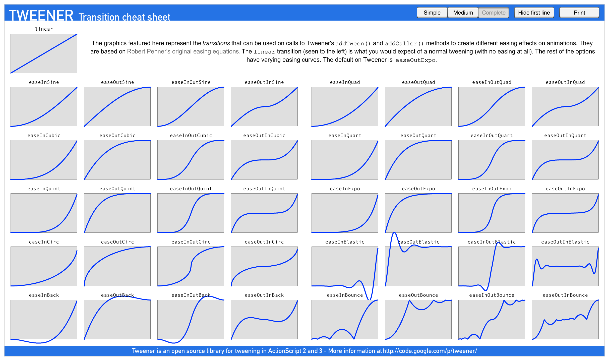

# Tweener 过渡效果速查表 - 中文翻译与解析



> **说明：** 请将图片保存为 `tweener-cheat-sheet.png` 放在同一目录

## 概述

此处显示的图形代表可以用于调用 Tweener 的 `addTween()` 和 `addCaller()` 方法的**过渡效果**，用于在动画上创建不同的缓动效果。

- **基于：** Robert Penner 的原始缓动方程
- **默认值：** `easeOutExpo`
- **linear 过渡：** 完全没有缓动的匀速运动

---

## 缓动函数分类详解

### 1. Linear（线性）
- **特点：** 匀速运动，没有加速或减速
- **曲线：** 直线
- **用途：** 需要恒定速度的动画

---

### 2. Sine 系列（正弦曲线）
平滑柔和的缓动效果

- **easeInSine** - 慢慢加速
- **easeOutSine** - 慢慢减速
- **easeInOutSine** - 先加速后减速，过渡平滑
- **easeOutInSine** - 先减速后加速

**推荐场景：** 自然、柔和的UI动画

---

### 3. Cubic 系列（三次方）
中等强度的缓动

- **easeInCubic** - 加速较明显
- **easeOutCubic** - 减速较明显
- **easeInOutCubic** - 先快速加速后快速减速
- **easeOutInCubic** - 先快速减速后快速加速

**推荐场景：** 常规UI动画，比Sine更有力度

---

### 4. Quart 系列（四次方）
较强的缓动效果

- **easeInQuart** - 加速非常明显
- **easeOutQuart** - 减速非常明显
- **easeInOutQuart** - 加速和减速都很强烈
- **easeOutInQuart** - 类似但顺序相反

**推荐场景：** 需要强调动画效果的场合

---

### 5. Quint 系列（五次方）
极强的缓动效果

- **easeInQuint** - 加速最为明显
- **easeOutQuint** - 减速最为明显
- **easeInOutQuint** - 极强的加减速效果
- **easeOutInQuint** - 类似但顺序相反

**推荐场景：** 戏剧性的动画效果

---

### 6. Expo 系列（指数）⭐
指数级的缓动效果

- **easeInExpo** - 指数级加速
- **easeOutExpo** - 指数级减速 **（Tweener 默认值）**
- **easeInOutExpo** - 指数级先加速后减速
- **easeOutInExpo** - 指数级先减速后加速

**推荐场景：** 快速、干脆的动画，UI元素出现/消失

---

### 7. Circ 系列（圆形）
基于圆形曲线的缓动

- **easeInCirc** - 圆形曲线加速
- **easeOutCirc** - 圆形曲线减速
- **easeInOutCirc** - 圆形曲线组合
- **easeOutInCirc** - 圆形曲线反向组合

**推荐场景：** 平滑但有力度的动画

---

### 8. Back 系列（回弹）🎯
带有回弹效果的缓动

- **easeInBack** - 先向后退一点再加速前进
- **easeOutBack** - 冲过终点后再回弹
- **easeInOutBack** - 两端都有回弹效果
- **easeOutInBack** - 中间有回弹效果

**推荐场景：** 有趣的UI动画，强调元素进入或离开

---

### 9. Bounce 系列（弹跳）⚽
模拟弹跳效果

- **easeInBounce** - 开始时有弹跳效果
- **easeOutBounce** - 结束时有弹跳效果（像球落地）
- **easeInOutBounce** - 两端都有弹跳
- **easeOutInBounce** - 中间有弹跳

**推荐场景：** 物理模拟，俏皮的动画效果

---

### 10. Elastic 系列（弹性）🎪
弹簧震荡效果

- **easeInElastic** - 开始时有弹簧震荡效果
- **easeOutElastic** - 结束时有弹簧震荡效果
- **easeInOutElastic** - 两端都有弹性震荡
- **easeOutInElastic** - 中间有弹性震荡

**推荐场景：** 夸张的动画效果，吸引注意力

---

## 命名规则说明

| 前缀 | 含义 | 效果 |
|------|------|------|
| **easeIn** | 缓入 | 动画**开始**时缓慢（慢启动） |
| **easeOut** | 缓出 | 动画**结束**时缓慢（慢停止） |
| **easeInOut** | 缓入缓出 | 动画**两端**都缓慢 |
| **easeOutIn** | 缓出缓入 | 在中间发生过渡变化 |

---

## 实用场景推荐

### UI 元素进入动画
```typescript
// 弹性进入 - 有趣味性
tween.to(target, { x: 100, y: 100 }, 0.5, { ease: "easeOutBack" });
tween.to(target, { x: 100, y: 100 }, 0.5, { ease: "easeOutElastic" });